<picture>
  <source media="(prefers-color-scheme: dark)" srcset="assets/blue-team-header-dark.svg">
  <source media="(prefers-color-scheme: light)" srcset="assets/blue-team-header-light.svg">
  
</picture>

<picture>
  <source media="(prefers-color-scheme: dark)" srcset="assets/defense-terminal-dark.svg">
  <source media="(prefers-color-scheme: light)" srcset="assets/defense-terminal-light.svg">
  
</picture>

<picture>
  <source media="(prefers-color-scheme: dark)" srcset="assets/security-toolbox-dark.svg">
  <source media="(prefers-color-scheme: light)" srcset="assets/security-toolbox-light.svg">
  
</picture>

<picture>
  <source media="(prefers-color-scheme: dark)" srcset="assets/defense-footer-dark.svg">
  <source media="(prefers-color-scheme: light)" srcset="assets/defense-footer-light.svg">
  
</picture>
