<picture>
  <source media="(prefers-color-scheme: dark)" srcset="assets/header-dark.svg">
  <source media="(prefers-color-scheme: light)" srcset="assets/header-light.svg">
  
</picture>

  <a href="https://github.com/guvenzencir?tab=repositories">Explore my projects</a> ·
  <a href="https://github.com/guvenzencir?tab=stars">What I'm exploring</a>

### $ whoami

I'm **Güven Zencir**, a Computer Engineering student at **Kayseri University**.
My interests sit where **network defense, machine learning and backend development** meet.

- 🛡️ Developing my skills in **Blue Team, network analysis and intrusion detection**.
- 🧠 Building **NetGuard**, a machine learning based network intrusion detection project.
- ⚙️ Working with **C#, ASP.NET Core Web API, Entity Framework Core and SQL**.
- 🔬 Exploring different detection models and comparing how they behave on network traffic.

### $ current_mission

**NetGuard · Machine Learning for Network Defense**

My focus is on analyzing network traffic, detecting attacks and anomalies, and comparing models such as **Random Forest** and **Isolation Forest**. I care about understanding the results as much as training the model.

<picture>
  <source media="(prefers-color-scheme: dark)" srcset="assets/packet-flow-dark.svg">
  <source media="(prefers-color-scheme: light)" srcset="assets/packet-flow-light.svg">
  
</picture>

### $ toolbox

| Area | Tools & interests |
| :--- | :--- |
| Network defense | Wireshark · Traffic analysis · IDS · Blue Team |
| Backend | C# · ASP.NET Core Web API · Entity Framework Core · REST APIs |
| Data & machine learning | Python · pandas · NumPy · scikit-learn |
| Databases | SQL Server · MySQL |
| Development | Git · GitHub · Visual Studio · VS Code |

### $ beyond_netguard

I also work on database-backed applications, including **parking management, library systems and ticket reservation**. These projects help me connect API design, data modeling and practical business rules.

---

<samp>Observe carefully. Build deliberately. Keep learning.</samp>

